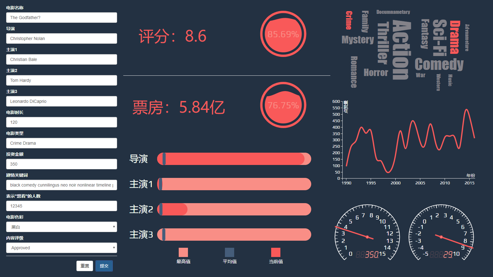

  
*****  
# 可视化图表模型  
### Liquid Fill Gauge  
表示目前预测电影的票房（或评分）超过电影领域其他作品的百分比  
### Bullet  
表示当前预测电影的主要剧组成员在自身领域的影响力。以颜色划分：浅红表示当前领域的最高影响力，深红表示被预测电影剧组成员在自身领域的影响力，深蓝表示当前领域的平均值。  
### Words Cloud  
表示电影类型的受欢迎程度。以字体尺寸划分：字体越大则该类型越受观众欢迎。  
### Line  
表示近26年（1990-2016）当前选取的电影类型（在词云图中选取）的受欢迎程度随时间的变化趋势。  
### Arc Axis  Guage  
左：表示投资方在该预测电影中的投资量比重。  
右：表示该预测电影若按输入投资实施，可能获得的收益比重。